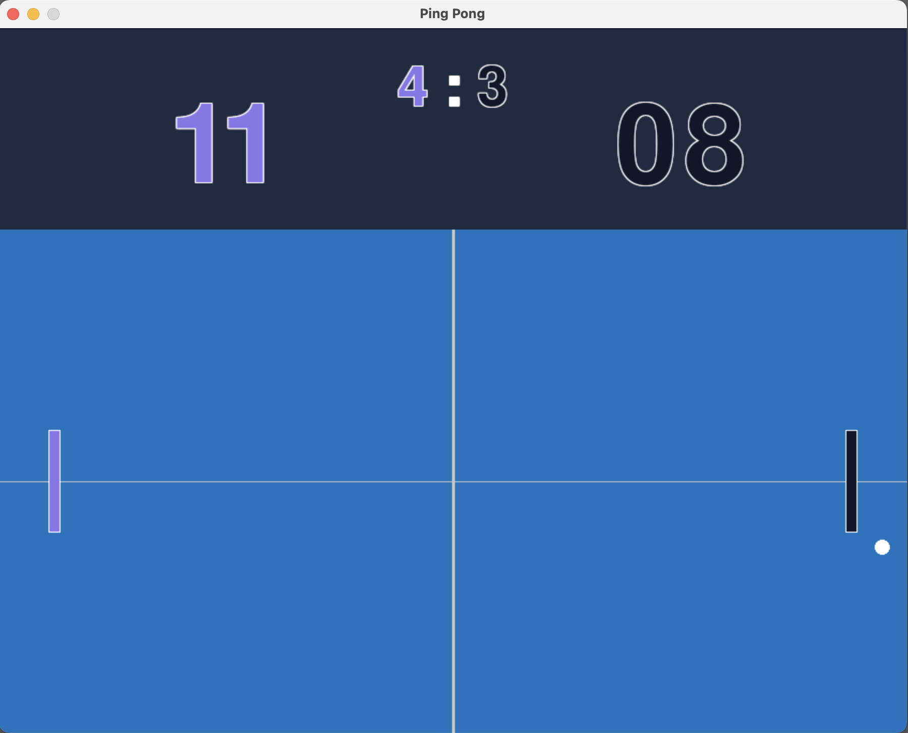

# Olympic Ping Pong RL Environment

This project aims to create a high-fidelity ping pong simulation environment that adheres to Olympic standards, providing a more realistic alternative to classic Atari Pong for reinforcement learning research. The ultimate goal is to implement the environment in C/C++ for performance and compatibility with standard RL frameworks.

### Current Status: Prototype Phase

This repository contains the initial pygame prototype used to validate game mechanics, physics, and visual design before moving to the production C/C++ implementation.

<p align="center">
  
  <br><em>Fig. 1: Olympic Ping Pong RL Environment Prototype<br>Built with Pygame</em>
</p>


## Olympic Table Tennis Specifications

The environment is designed around official Olympic/ITTF regulations:

- **Table Dimensions**: 2.74m × 1.525m (9ft × 5ft)
- **Table Height**: 0.76m (2.5ft) from ground
- **Net Height**: 15.25cm (6in)
- **Ball Diameter**: 40mm
- **Racket (paddle)**: 17cm (6.7in) × 15cm (5.9in)
- **Scoring**: Rally point system (first to 11 points, win by 2)
- **Service Rules**: Ball must bounce once on each side

## Project Roadmap

### Phase 1: Pygame Prototype (Current)
- [x] Basic game mechanics implementation
- [x] Score tracking system
- [x] Visual design and UI
- [x] Paddle physics and controls
- [x] Ball collision detection

### Phase 2: C/C++ Core Environment (Planned)
- [ ] Implement game engine in C/C++
- [ ] OpenGL/SDL rendering
- [ ] Physics engine with proper ball spin and trajectory
- [ ] Gymnasium/Gym API compatibility
- [ ] Performance optimization for batch training

### Phase 3: RL Integration (Planned)
- [ ] Observation space design (pixel-based and state-based)
- [ ] Action space definition
- [ ] Reward function engineering
- [ ] PPO baseline implementation
- [ ] Training pipeline and benchmarks

### Phase 4: Advanced Features (Future)
- [ ] Ball spin mechanics
- [ ] Service variations
- [ ] Multi-agent training support
- [ ] Tournament mode
- [ ] Telemetry and analytics

## Pygame Prototype

### Requirements
```bash
pip install pygame
```

### Running the Prototype
```bash
python ping_pong.py
```

### Controls
- **Left Paddle**: W (up) / S (down)
- **Right Paddle**: Arrow Up / Arrow Down

### Features
- Match score tracking (first to 11 points)
- Total matches played counter
- Olympic-inspired color scheme
- Smooth 60 FPS gameplay
- Score display with outlined text

## Why C/C++ for Production?

1. **Performance**: Critical for training RL agents with millions of environment steps
2. **Integration**: Better compatibility with popular RL frameworks (e.g., stable-baselines3, RLlib)
3. **Parallelization**: Easier to implement vectorized environments for parallel training
4. **Determinism**: More precise control over physics and random number generation
5. **Deployment**: Easier to package and distribute as a Gymnasium environment

## Comparison to Atari Pong

| Feature | Atari Pong | Olympic Ping Pong |
|---------|-----------|-------------------|
| Physics | Simplified arcade | Realistic ball dynamics |
| Dimensions | Arbitrary | Official Olympic specs |
| Scoring | First to 21 | Rally point (11, win by 2) |
| Ball Behavior | Linear bounce | Spin, trajectory variation |
| State Space | 2D paddles + ball | Full 3D potential |

## Research Applications

This environment is suitable for:
- **Transfer Learning**: Pre-training on simpler tasks before real robot control
- **Algorithm Benchmarking**: Testing PPO, SAC, DQN variants
- **Multi-Agent RL**: Self-play and opponent modeling
- **Curriculum Learning**: Progressive difficulty scaling
- **Sim-to-Real**: Foundation for physical robot table tennis

## Future RL Experiments

Planned experiments with the C/C++ environment:
- PPO vs SAC performance comparison
- Curriculum learning from random opponent to expert
- Self-play for emergent strategies
- Reward shaping studies
- Sample efficiency analysis

## License

MIT